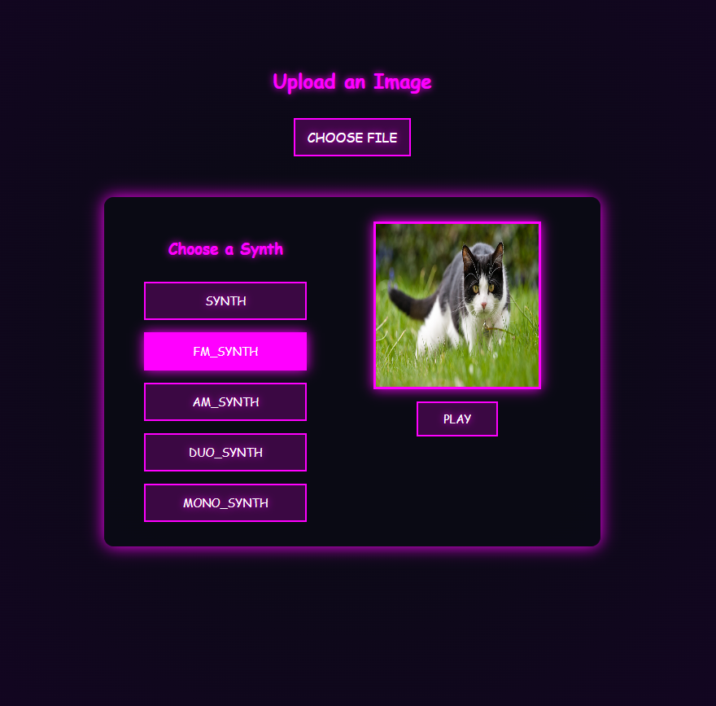

# **Image To Text Generator**
By: Brennan Mulligan

---

## Project Overview

This is a simple webpage that when given an image, allows for a track to be played generated by a selected synth from the uploaded image.

Visit: 
https://image-to-sound.onrender.com/

### Preview

---

## Tech Stack

**Front End**
- React: Component based UI
- TypeScript: Type secured JavaScript
- CSS: Styling for UI
- Tone.js: Web Audio API for synthesizing sound
- Docker: Ensuring app works remotely
- Render: Used to deploy and host the application

---

## How does it work?

- Once an image is uploaded, the ImageToNotes component will read its pixel data. This will result in (R,G,B,A) being extracted from each pixel and stored in an array.
- Once gathered the pixel data is then mapped to musical notes,
 - R: Pitch
 - B/G: Octave variations and effects
 - Opacity(A): IF present, note intensity/duration
 - Done in noteUtils.ts
- Using the synthesizer selected, plays each note generated using Tone.js

---

## Installation

1. Clone the repo
2. Run "npm install" in console
3. Run "npm run dev" in console

Included is also a dockerfile, used for deployment.

---

### License
This project is open-source and available under the MIT License